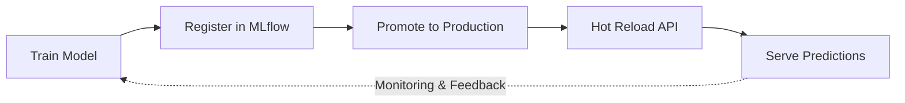

# Housing Price Prediction API

Sistema MLOps para predicción de precios de viviendas mediante API REST. Stack 100% open-source, portable e independiente de proveedores cloud.

> **Out-of-the-box:** El proyecto incluye un modelo pre-entrenado para funcionar inmediatamente sin necesidad de entrenar primero.

### Highlights

| Característica | Descripción |
|----------------|-------------|
| **Hot Reload** | Actualizar modelo en producción sin downtime |
| **Model Registry** | Versionado y promoción con aliases (MLflow) |
| **Métricas Prometheus** | Monitoreo modelo y inferencia |
| **Detección de Data Drift** | Alertas de valores fuera de rango |
| **100% Containerizado** | Stack portable y reproducible |
| **CI/CD Ready** | Pipeline con GitHub Actions |

---

## Prerequisitos

Antes de comenzar, asegúrate de tener instalado:

| Herramienta | Versión | Instalación |
|-------------|---------|-------------|
| **Python** | 3.12+ | [python.org](https://python.org) |
| **uv** | latest | `pip install uv` o `curl -LsSf https://astral.sh/uv/install.sh \| sh` |
| **Docker** | 20.10+ | [docker.com](https://docker.com) |
| **Docker Compose** | 2.0+ | Incluido con Docker Desktop |
| **make** | - | Solo Linux/macOS/WSL (opcional en Windows) |

> **Windows:** Si no tienes `make`, puedes usar los comandos directos. Ver [Notas para Windows](#notas-para-windows).

---

## Tabla de Contenidos

- [Prerequisitos](#prerequisitos)
- [Notas para Windows](#notas-para-windows)
- [Arquitectura](#arquitectura)
- [Flujo MLOps Completo](#flujo-mlops-completo)
- [Comandos](#comandos)
- [Entrenamiento](#entrenamiento)
- [Reentrenamiento en Producción](#reentrenamiento-en-producción)
- [API REST](#api-rest)
- [Docker](#docker)
- [Monitoreo](#monitoreo)
- [CI/CD](#cicd)
- [Troubleshooting](#troubleshooting)
- [Decisiones Técnicas](#decisiones-técnicas)
- [Estado Actual y Mejoras](#estado-actual-y-mejoras)
- [Nota para Evaluadores](#nota-para-evaluadores)
- [Uso de Herramientas AI](#uso-de-herramientas-ai)

---

## Notas para Windows

Si estás usando Windows sin WSL, ten en cuenta lo siguiente:

### make no está disponible

El comando `make` no viene instalado por defecto en Windows. Tienes dos opciones:

1. **Usar WSL2 (recomendado):** Instala [WSL2](https://docs.microsoft.com/en-us/windows/wsl/install) para tener un entorno Linux completo.

2. **Usar comandos directos:** Consulta la tabla [Make vs Sin Make](#referencia-rápida-make-vs-sin-make) para los equivalentes.

### El seed automático no funciona en Docker

Cuando usas `docker compose` directamente en Windows (sin `make dev`), el modelo seed **no se carga automáticamente**. Debes ejecutarlo manualmente:

```bash
# Después de levantar la infraestructura
docker compose up -d postgres minio minio-init mlflow

# Esperar a que MLflow esté listo (~30 segundos) y luego:
uv run python scripts/seed_mlflow.py
```

### Comandos esenciales sin make

```bash
# Instalar dependencias
uv sync

# Levantar infraestructura
docker compose up -d postgres minio minio-init mlflow

# Seed del modelo (manual)
uv run python scripts/seed_mlflow.py

# Iniciar API
uv run uvicorn src.api.main:app --reload --port 8000

# Entrenar modelo
uv run python -m src.cli.main train

# Promover modelo
uv run python -m src.cli.main promote --version 2
```

---

## Arquitectura

```
┌─────────────────────────────────────────────────────────────────────────────┐
│                              TRAINING PIPELINE                              │
├─────────────────────────────────────────────────────────────────────────────┤
│                                                                             │
│   HousingData.csv                                                           │
│         │                                                                   │
│         ▼                                                                   │
│   ┌───────────┐    ┌──────────────────┐    ┌───────────────────┐            │
│   │  Loader   │───▶│  Preprocessing  │───▶│   Model Training  │            │
│   │           │    │  (v1/v2/v3)      │    │  (RF/GB/XGB/LR)   │            │
│   └───────────┘    └──────────────────┘    └─────────┬─────────┘            │
│                                                      │                      │
│                    ┌─────────────────────────────────┼────────────────┐     │
│                    │                                 ▼                │     │
│                    │  ┌─────────────────┐    ┌─────────────────┐      │     │
│                    │  │ Artifact Bundle │    │     MLflow      │      │     │
│                    │  │  model.joblib   │    │  Tracking Server│      │     │
│                    │  │  preprocessor   │    │  Model Registry │      │     │
│                    │  │  metadata.json  │    └─────────────────┘      │     │
│                    │  └────────┬────────┘                             │     │
│                    │           │                                      │     │
└────────────────────┼───────────┼──────────────────────────────────────┼─────┘
                     │           │                                      │
┌────────────────────┼───────────┼──────────────────────────────────────┼────┐
│                    │           ▼               INFERENCE API          │    │
├────────────────────┼──────────────────────────────────────────────────┼────┤
│                    │  ┌─────────────────────────────────────────┐     │    │
│                    │  │              FastAPI                    │     │    │
│                    │  │  ┌──────────┐  ┌──────────┐  ┌────────┐ │     │    │
│                    │  │  │ /predict │  │ /health  │  │/metrics│ │     │    │
│                    │  │  └──────────┘  └──────────┘  └────────┘ │     │    │
│                    │  │  ┌──────────────┐  ┌─────────────────┐  │     │    │
│                    │  │  │ /model/info  │  │ /model/reload   │  │     │    │
│                    │  │  └──────────────┘  └─────────────────┘  │     │    │
│                    │  └─────────────────────────────────────────┘     │    │
│                    │         │ /metrics (scrape)                      │    │
│                    │         ▼  Prometheus → Grafana (dashboards)      │    │
└────────────────────┴──────────────────────────────────────────────────┴────┘
```

*Prometheus scrapea `/metrics` de la API; Grafana consume Prometheus para dashboards.*

### Estructura del Proyecto

```
meli_challenge/
├── src/
│   ├── api/                    # API REST (FastAPI)
│   │   ├── main.py             # Endpoints: /predict, /model/reload, etc.
│   │   ├── schemas.py          # Validación Pydantic
│   │   ├── middleware.py       # Métricas Prometheus
│   │   └── security.py         # Autenticación API Key
│   │
│   ├── cli/                    # Interfaz de línea de comandos
│   │   ├── main.py             # App Typer
│   │   ├── train.py            # Entrenamiento
│   │   ├── register.py         # Registro en MLflow
│   │   ├── promote.py          # Promoción de modelos
│   │   ├── runs.py             # Listar experimentos
│   │   └── info.py             # Información del modelo local
│   │
│   ├── models/                 # Modelos ML (Strategy Pattern)
│   │   ├── base.py             # Clase base abstracta
│   │   ├── factory.py          # Factory con registro
│   │   ├── evaluate.py         # Métricas (RMSE, MAE, R², MAPE)
│   │   ├── cross_validation.py # K-Fold CV
│   │   └── strategies/         # RandomForest, GradientBoost, XGBoost, Linear
│   │
│   ├── data/                   # Carga y preprocesamiento
│   │   ├── loader.py           # Carga y validación
│   │   ├── cache.py            # Cache de datos preprocesados (sync con MinIO)
│   │   └── preprocessing/      # Estrategias: v1_median, v2_knn, v3_iterative, v4_robust_col
│   │
│   ├── experiments/            # Sistema de experimentación
│   │   ├── runner.py           # Grid search desde YAML
│   │   └── config.yaml         # Configuración de experimentos
│   │
│   ├── artifacts/              # Empaquetado de artefactos
│   │   ├── bundle.py           # MLArtifactBundle (modelo + preprocesador)
│   │   └── metadata.py         # Metadatos del modelo
│   │
│   ├── training/               # Orquestación de entrenamiento
│   │   └── core.py             # Pipeline de entrenamiento
│   │
│   ├── utils/                  # Utilidades
│   │   ├── hashing.py          # Hashing de artefactos
│   │   └── mlflow_helpers.py   # Helpers para MLflow
│   │
│   ├── logging_config.py       # Configuración de logging estructurado
│   └── config/settings.py      # Configuración centralizada
│
├── data/HousingData.csv        # Dataset
├── models/                     # Modelos entrenados (bundle)
├── scripts/                    # Scripts utilitarios
├── tests/                      # Tests (pytest)
├── Dockerfile                  # Imagen de la API
├── Dockerfile.mlflow           # Imagen de MLflow
├── docker-compose.yml          # Orquestación de servicios
├── Makefile                    # Comandos unificados
└── pyproject.toml              # Dependencias (uv/pip)
```

---

## Flujo MLOps Completo

El sistema implementa un ciclo completo de MLOps:



| Etapa | Comando | Descripción |
|-------|---------|-------------|
| **Train** | `make train` | Entrena y evalúa con CV opcional |
| **Register** | `make register RUN_ID=xxx` | Versiona en Model Registry |
| **Promote** | `make promote VERSION=x` | Asigna alias "production" |
| **Reload** | `curl .../model/reload` | Recarga sin reiniciar API |
| **Serve** | Automático | Predicciones con modelo actualizado |

### Demostración Práctica (Ciclo Completo)

#### Paso 1: Setup inicial con modelo pre-cargado

```bash
# Levantar todo el stack (infra + seed + API)
make up

# Verificar predicción
make predict
# { "prediction": 30.25, "model_version": "v1", ... }
```

> **Windows (sin make):** Ejecutar manualmente:
> ```bash
> docker compose up -d postgres minio minio-init mlflow
> # Esperar ~30s, luego:
> uv run python scripts/seed_mlflow.py
> docker compose up -d api
> ```

#### Paso 2: Reentrenamiento con flujo interactivo

```bash
# Entrenar nuevo modelo
make train
# → Seleccionar: random_forest, v2_knn, CV=5
# → "¿Registrar en MLflow?" → Sí
# Salida: ✓ Registered as housing-price-model v2

# Promover a producción
make promote VERSION=2

# Recargar API sin downtime
curl -X POST http://localhost:8000/model/reload -H "X-API-Key: dev-api-key"

# Verificar nuevo modelo
make predict
# { "prediction": 29.80, "model_version": "v2", ... }
```

#### Paso 3: Experimentación con grid search

```bash
# Ejecutar grid search (múltiples combinaciones)
make experiment
# → Entrena: gradient_boost + random_forest × v1_median + v2_knn
# → Muestra tabla comparativa
# → Best Model: gradient_boost_v2_knn (Run ID: abc123...)

# Registrar el mejor modelo
make register RUN_ID=abc123

# Promover a producción
make promote VERSION=3

# Recargar API
curl -X POST http://localhost:8000/model/reload -H "X-API-Key: dev-api-key"

# Verificar
make predict
# { "prediction": 30.10, "model_version": "v3", ... }
```

---

## Comandos

### Referencia Rápida: Make vs Sin Make

| Acción | Con Make | Sin Make |
|--------|----------|----------|
| **Setup** | | |
| Instalar dependencias | `make install` | `uv sync` |
| Setup completo | `make setup` | `uv sync && mkdir -p models data` |
| **Entrenamiento** | | |
| Entrenar (interactivo) | `make train` | `uv run python -m src.cli.main train` |
| Grid search (automatizado) | `make experiment` | `uv run python scripts/run_experiment.py --config src/experiments/config.yaml` |
| **Gestión de Modelos** | | |
| Listar experimentos | `make runs` | `uv run python -m src.cli.main runs` |
| Registrar modelo | `make register RUN_ID=xxx` | `uv run python -m src.cli.main register <run_id>` |
| Listar versiones | `make models` | `uv run python -m src.cli.main promote --list` |
| Promover versión | `make promote VERSION=2` | `uv run python -m src.cli.main promote --version 2` |
| Info del modelo local | `make info` | `uv run python -m src.cli.main info` |
| **API** | | |
| Iniciar API (dev) | `make api` | `uv run uvicorn src.api.main:app --reload --port 8000` |
| Predicción de prueba | `make predict` | `curl -X POST http://localhost:8000/predict -H "Content-Type: application/json" -H "X-API-Key: dev-api-key" -d '{"CRIM":0.00632,...}'` |
| **Docker** | | |
| Levantar todo | `make up` | `docker compose up -d` |
| Solo infraestructura | `make dev` | `docker compose up -d postgres minio minio-init mlflow` |
| Detener servicios | `make down` | `docker compose down` |
| Ver logs | `make logs` | `docker compose logs -f` |
| Limpiar volúmenes | `make clean` | `docker compose down -v` |
| **Testing** | | |
| Ejecutar tests | `make test` | `uv run pytest tests/ -v` |
| Linting | `make lint` | `uv run ruff check src/ tests/` |
| CI completo | `make ci` | `make lint && make test && docker build -t housing-api .` |
| **Demo** | | |
| Seed MLflow | `make seed` | `uv run python scripts/seed_mlflow.py` |

### Ver Todos los Comandos

```bash
make help
```

---

## Entrenamiento

### Modo Interactivo (Por Defecto)

El comando `make train` inicia un asistente interactivo que guía la selección de:

1. **Tipo de modelo** - Random Forest, Gradient Boosting, XGBoost, Linear Regression
2. **Estrategia de preprocesamiento** - v1_median, v2_knn, v3_iterative, v4_robust_col
3. **Cross-validation** - Opcional, con número de splits configurable
4. **Registro en MLflow** - Opcional

```bash
# Entrenamiento interactivo (recomendado)
make train
# o: uv run python -m src.cli.main train
```

### Flujo Interactivo

El asistente guía paso a paso:

```
1. Seleccionar modelo → random_forest, gradient_boost, xgboost, linear
2. Seleccionar preprocesamiento → v1_median, v2_knn, v3_iterative, v4_robust_col
3. ¿Configurar hiperparámetros? → Personalizar n_estimators, max_depth, etc.
4. ¿Habilitar cross-validation? → 5-fold CV por defecto
5. Entrenamiento y evaluación
6. ¿Registrar en MLflow? → Versionar el modelo
```

Para **automatización/scripts**, usar el sistema de experimentos con YAML (ver siguiente sección).

### Experimentación (Grid Search)

Para probar múltiples combinaciones automáticamente:

```bash
# Ejecutar grid search desde YAML
make experiment
# → Entrena todas las combinaciones
# → Muestra tabla comparativa
# → Indica el mejor modelo con su Run ID

# Registrar el mejor modelo manualmente
make register RUN_ID=<run_id_del_mejor>

# Promover a producción
make promote VERSION=<version>
```

Configuración en `src/experiments/config.yaml`:

```yaml
experiment:
  name: "housing-tuning"
  description: "Grid search de modelos"

grid:
  models:
    - random_forest
    - gradient_boost
  preprocessors:
    - v1_median
    - v2_knn

settings:
  enable_cv: true
  cv_splits: 5
```

> **Nota:** A diferencia de `make train`, el grid search no registra modelos automáticamente. Esto permite comparar todos los resultados en MLflow UI antes de decidir cuál registrar.

### Métricas de Evaluación

| Métrica | Descripción |
|---------|-------------|
| **RMSE** | Root Mean Squared Error (métrica principal) |
| **MAE** | Mean Absolute Error |
| **R²** | Coeficiente de determinación |
| **MAPE** | Mean Absolute Percentage Error |

### Cache de Datos Preprocesados

El sistema incluye un cache inteligente que evita recalcular el preprocesamiento:

```
get_or_create():
  1. ¿Existe local?     → Usar cache local
  2. ¿Existe en MinIO?  → Descargar de S3
  3. No existe          → Crear + subir a MinIO
```

**Beneficios:**
- Preprocesamiento calculado una sola vez por estrategia
- Sincronización automática con MinIO (S3)
- Acelera `make train` y `make experiment`

**Comandos:**
```bash
make cache-status   # Ver versiones cacheadas
make cache-clear    # Limpiar cache local (se re-descarga de MinIO)
```

---

## Reentrenamiento en Producción

El sistema permite reentrenar y actualizar modelos **sin downtime**.

### Flujo de Reentrenamiento

```bash
# 1. Entrenar nuevo modelo (interactivo)
make train
# → Seleccionar: random_forest, v2_knn, CV=5
# → "¿Registrar en MLflow?" → Sí
# Salida: ✓ Registered as housing-price-model v3

# 2. Promover a producción
make promote VERSION=3

# 3. Recargar modelo en API (sin reiniciar)
curl -X POST http://localhost:8000/model/reload -H "X-API-Key: dev-api-key"
# { "status": "success", "model_version": "v3" }
```

### Hot Reload de Modelo

La API puede recargar el modelo desde MLflow sin reiniciarse:

```bash
# Recargar modelo con alias por defecto (production)
curl -X POST http://localhost:8000/model/reload
```

**Respuesta:**
```json
{
  "status": "success",
  "message": "Model reloaded successfully",
  "model_info": {
    "model_type": "random_forest",
    "preprocessing": "v2_knn",
    "version": "2"
  }
}
```

### Sistema de Aliases

MLflow Model Registry permite gestionar múltiples versiones:

```bash
# Ver versiones y aliases actuales
make models

# Promover versión 3 a producción
make promote VERSION=3

# La API siempre carga el modelo con alias "production"
```

---

## API REST

### Endpoints

| Endpoint | Método | Descripción | Auth |
|----------|--------|-------------|------|
| `/` | GET | Información de la API | No |
| `/health` | GET | Health check | No |
| `/predict` | POST | Predicción individual | Sí* |
| `/predict/batch` | POST | Predicciones en lote (máx 100) | Sí* |
| `/model/info` | GET | Metadata del modelo cargado | No |
| `/model/reload` | POST | Recargar modelo desde MLflow | Sí* |
| `/metrics` | GET | Métricas Prometheus | No |

*Requiere header `X-API-Key` si `API_KEY` está configurado.

### Ejemplos de Uso

**Predicción individual:**
```bash
curl -X POST http://localhost:8000/predict \
  -H "Content-Type: application/json" \
  -H "X-API-Key: dev-api-key" \
  -d '{
    "CRIM": 0.00632,
    "ZN": 18.0,
    "INDUS": 2.31,
    "CHAS": 0,
    "NOX": 0.538,
    "RM": 6.575,
    "AGE": 65.2,
    "DIS": 4.09,
    "RAD": 1,
    "TAX": 296.0,
    "PTRATIO": 15.3,
    "B": 396.9,
    "LSTAT": 4.98
  }'
```

**Respuesta:**
```json
{
  "prediction": 30.25,
  "model_version": "random_forest_v2_knn",
  "timestamp": "2025-01-15T10:30:00Z",
  "warnings": []
}
```

**Predicción en lote:**
```bash
curl -X POST http://localhost:8000/predict/batch \
  -H "Content-Type: application/json" \
  -H "X-API-Key: dev-api-key" \
  -d '{
    "items": [
      {"CRIM": 0.00632, "ZN": 18.0, ...},
      {"CRIM": 0.02731, "ZN": 0.0, ...}
    ]
  }'
```

**Info del modelo:**
```bash
curl http://localhost:8000/model/info
```

### Detección de Anomalías

La API detecta automáticamente cuando los valores de entrada están fuera del rango observado durante el entrenamiento:

```json
{
  "prediction": 45.2,
  "warnings": [
    "Feature 'RM' value 12.5 is outside training range [3.56, 8.78]"
  ]
}
```

---

## Docker

### Servicios

| Servicio | Puerto | Descripción |
|----------|--------|-------------|
| `api` | 8000 | API de predicción (FastAPI) |
| `mlflow` | 5000 | MLflow Tracking Server + Model Registry |
| `postgres` | 5432 | Base de datos para metadata de MLflow |
| `minio` | 9000/9001 | Almacenamiento S3-compatible para artefactos |

### Modos de Uso

**Desarrollo (API local + infraestructura en Docker):**
```bash
make dev          # Levanta PostgreSQL, MinIO, MLflow
make api          # Inicia API local con hot-reload
```

**Producción (todo en Docker):**
```bash
make up           # Levanta todos los servicios
```

**Detener:**
```bash
make down         # Detiene servicios (mantiene datos)
make clean        # Detiene y elimina volúmenes
```

### Variables de Entorno

El archivo `.env` es **opcional**. Docker Compose usa valores por defecto que funcionan out-of-the-box para desarrollo.

Si deseas personalizar la configuración:

```bash
cp .env.example .env
# Editar .env según necesidades
```

| Variable | Descripción | Default |
|----------|-------------|---------|
| **API** | | |
| `API_KEY` | Clave de autenticación (opcional) | - |
| `API_PORT` | Puerto de la API | `8000` |
| **MLflow** | | |
| `MLFLOW_TRACKING_URI` | URI del servidor MLflow | `http://localhost:5000` |
| `MLFLOW_MODEL_NAME` | Nombre del modelo en registry | `housing-price-model` |
| `MLFLOW_MODEL_ALIAS` | Alias a cargar | `production` |
| **PostgreSQL** | | |
| `POSTGRES_USER` | Usuario de PostgreSQL | `mlflow` |
| `POSTGRES_PASSWORD` | Password de PostgreSQL | `mlflow123` |
| `POSTGRES_DB` | Base de datos | `mlflow` |
| **MinIO (S3)** | | |
| `MINIO_ROOT_USER` | Usuario de MinIO | `minioadmin` |
| `MINIO_ROOT_PASSWORD` | Password de MinIO | `minioadmin123` |
| `MLFLOW_BUCKET_NAME` | Bucket para artefactos | `mlflow-artifacts` |
| **Monitoring** | | |
| `METRICS_ENABLED` | Habilitar métricas Prometheus | `true` |
| `PROMETHEUS_PORT` | Puerto de Prometheus (Compose) | `9090` |
| `GRAFANA_PORT` | Puerto de Grafana (Compose) | `3000` |
| `GRAFANA_ADMIN_PASSWORD` | Contraseña admin de Grafana | `admin` (cambiar en producción) |

---

## Monitoreo

Con `make up` se levantan **Prometheus** y **Grafana** además de la API. Prometheus scrapea `/metrics` cada 15s; Grafana tiene el datasource Prometheus ya configurado.

- **Prometheus:** http://localhost:9090 — targets en `/targets`, consultas en `/graph`
- **Grafana:** http://localhost:3000 — usuario `admin`, contraseña por defecto `admin` (configurable con `GRAFANA_ADMIN_PASSWORD` en `.env`). El datasource "Prometheus" está provisionado; en **Explore** puedes ejecutar por ejemplo `rate(predictions_total[1m])` o `histogram_quantile(0.95, rate(prediction_duration_seconds_bucket[5m]))`. Para crear un dashboard: **Dashboards → New → Add visualization**, elegir Prometheus y las métricas siguientes.

**Generar tráfico para ver el dashboard:** ejecuta `make load-demo` (por defecto 15 s, 1 req/s). Puedes configurar duración e intervalo: `make load-demo DURATION=60 INTERVAL=0.5`. Los datos se generan con variación aleatoria en los rangos válidos para simular tráfico más realista.

### Métricas Prometheus (API `/metrics`)

La API expone métricas en `/metrics` (nombres alineados con el código):

| Métrica | Tipo | Descripción |
|---------|------|-------------|
| `http_requests_total` | Counter | Total de peticiones HTTP (labels: method, endpoint, status_code) |
| `http_request_duration_seconds` | Histogram | Latencia de peticiones HTTP |
| `predictions_total` | Counter | Total de predicciones realizadas |
| `prediction_duration_seconds` | Histogram | Latencia de predicciones |
| `model_prediction_value` | Histogram | Distribución de valores predichos (precio en $1000s) |
| `prediction_input_out_of_range_total` | Counter | Features fuera de rango por feature (data drift) |
| `model_load_total` | Counter | Intentos de carga de modelo (labels: status, source) |

### MLflow UI

```bash
# Acceder a la UI
open http://localhost:5000
```

Funcionalidades:
- Comparar experimentos (métricas, parámetros)
- Visualizar artefactos (modelo, preprocesador)
- Gestionar Model Registry (versiones, aliases)

---

## CI/CD

Pipeline automatizado con GitHub Actions:

```
┌─────────┐    ┌─────────┐    ┌─────────┐
│  lint   │──▶│  test   │───▶│  build  │
│ (ruff)  │    │(pytest) │    │(docker) │
└─────────┘    └─────────┘    └─────────┘
```

**Jobs:**
1. **lint** - Verificación de código con Ruff
2. **test** - Tests con pytest (cobertura mínima 70%)
3. **build** - Construcción de imagen Docker

### Ejecutar CI Localmente

```bash
make ci
```

---

## Troubleshooting

| Problema | Causa | Solución |
|----------|-------|----------|
| MLflow no inicia | Contenedor iniciando | Esperar 30-60s, verificar con `docker logs mlflow-server` |
| API error "Model not found" | Modelo no registrado | Ejecutar `make seed` o `uv run python scripts/seed_mlflow.py` |
| Puerto en uso | Conflicto de puertos | Cambiar `API_PORT` o `MLFLOW_PORT` en `.env` |
| "Connection refused" en MLflow | Servicios no iniciados | Verificar `docker compose ps`, reiniciar con `make up` |
| Predicción devuelve error 422 | Datos inválidos | Verificar que todos los 13 features estén presentes |

**Verificar estado de servicios:**
```bash
docker compose ps                    # Estado de contenedores
docker logs mlflow-server            # Logs de MLflow
curl http://localhost:8000/health    # Health check de API
curl http://localhost:5000/health    # Health check de MLflow
```

---

## Decisiones Técnicas

### Stack Tecnológico

| Componente | Tecnología | Justificación |
|------------|------------|---------------|
| API Framework | FastAPI + Pydantic | Async, validación automática, docs OpenAPI |
| ML Framework | scikit-learn + XGBoost | Madurez, pipelines reproducibles, gradient boosting |
| Experiment Tracking | MLflow | Estándar de industria, Model Registry |
| Data Cache | boto3 + MinIO | Cache de preprocesamiento con sync S3 automático |
| Métricas | Prometheus Client | Observabilidad, integración con Grafana |
| Logging | structlog | Logging estructurado (JSON), debugging en prod |
| Configuración | OmegaConf | Config YAML tipada para experimentos |
| Containerización | Docker + Compose | Portabilidad, orquestación local |
| Package Manager | uv | Velocidad, lockfile determinístico |
| CLI | Typer + Rich | Autocompletado, output formateado |
| DB (MLflow) | PostgreSQL | Robustez, producción-ready |
| Artifacts Storage | MinIO | S3-compatible, self-hosted |
| Testing | pytest + pytest-cov | Tests unitarios, cobertura |
| Linting | Ruff | Linter rápido, formateador integrado |

### Patrones de Diseño

| Patrón | Aplicación | Beneficio |
|--------|------------|-----------|
| **Strategy** | Modelos y preprocesadores | Intercambiabilidad sin modificar código |
| **Factory** | Creación de instancias | Registro centralizado, extensibilidad |
| **Artifact Bundle** | Empaquetado | Modelo + preprocesador + metadata atómico |

### Estrategias de Preprocesamiento

| Versión | Estrategia | Caso de uso |
|---------|------------|-------------|
| `v1_median` | SimpleImputer(median) + StandardScaler | Baseline |
| `v2_knn` | KNNImputer + StandardScaler | Missing values correlacionados |
| `v3_iterative` | IterativeImputer + StandardScaler | Patrones complejos |
| `v4_robust_col` | ColumnTransformer + RobustScaler | Datos con outliers |

---

## Roadmap y Mejoras Futuras

### Próximos pasos

| Mejora | Descripción | Justificación |
|--------|-------------|---------------|
| **Versionamiento de Datos** | Control de versiones para datasets (ej: DVC, LakeFS) | Reproducibilidad completa de experimentos históricos |
| **Dashboard Grafana** | Visualización de métricas Prometheus | Implementado: Prometheus + Grafana en el stack; ver [Monitoreo](#monitoreo) |
| **Detección de Drift** | Alertas con PSI/KS-test | Detectar cuándo el modelo necesita reentrenamiento |
| **Explicabilidad (SHAP)** | Endpoint `/explain` con importancia de features | Transparencia en decisiones de crédito |

### Evolución del sistema

| Mejora | Descripción |
|--------|-------------|
| **Validación de Datos (Great Expectations)** | Rechazar datos corruptos antes del modelo |
| **Continuous Training** | Triggers automáticos por degradación de métricas |
| **A/B Testing / Shadow Mode** | Validar modelos nuevos contra producción |
| **Rate Limiting** | Protección contra abuso de API |

### Consideraciones de Escalabilidad

> La arquitectura actual (Docker Compose + MinIO + PostgreSQL) está diseñada para facilitar la migración a:
> - **Kubernetes** con HPA para manejo de picos de tráfico
> - **AWS S3/GCP Storage** como reemplazo transparente de MinIO
>
> **Para sistemas con múltiples modelos y tiempo real:**
> - **Orquestadores (Airflow/Dagster)**: Gestión de pipelines complejos con dependencias, reintentos y linaje de datos
> - **Feature Store (Feast)**: Capa centralizada para consistencia de features entre entrenamiento e inferencia en tiempo real

---

## Nota para Evaluadores

> **Archivos incluidos intencionalmente:** Los directorios `models/` y `seed/` están versionados para que el proyecto funcione **out-of-the-box** sin configuración adicional.
>
> Esto permite:
> - Ejecutar `make up` y tener predicciones funcionando inmediatamente
> - Probar el flujo completo sin entrenar primero
> - Evaluar la arquitectura sin dependencias externas
>
> **En producción real**, estos artefactos NO se versionarían:


---

## Uso de Herramientas AI

Este proyecto fue desarrollado con asistencia de herramientas de inteligencia artificial. Para detalles completos sobre las herramientas utilizadas y los principios aplicados, consulta **[AI_USAGE.md](AI_USAGE.md)**.

---

## Licencia

MIT
